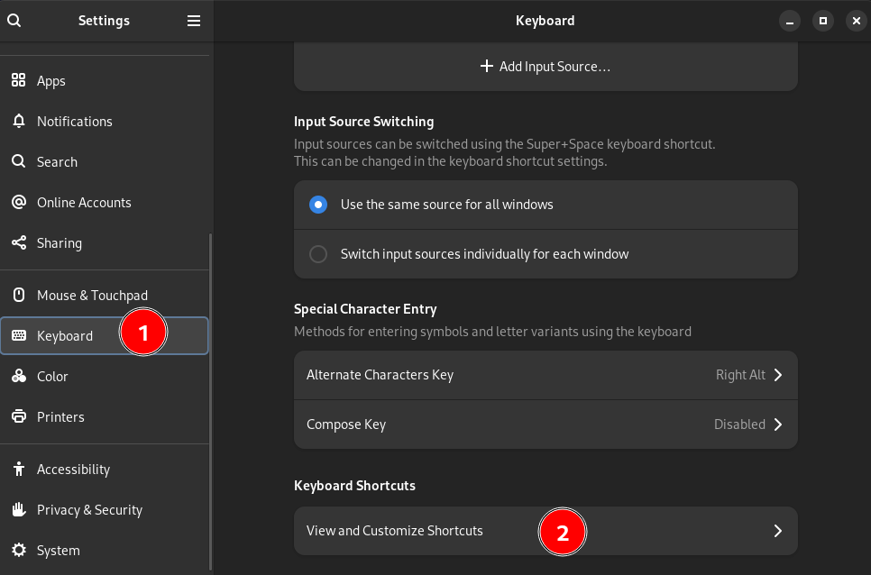

# 👴 Hajji
Hajji is a shell script that allows you to search emojies and copy them to your clipboard with an interface that you are used to (your terminal). You can then paste the selected emoji anywhere you want. Checkout the [Demo](#demo)!

# Installation
- `git clone https://github.com/moalhaddar/hajji`

# How to run
## 1. Manually
You can execute the script `./open-window.sh` in this repo to show the emojies like in the [Demo](#demo)

## 2. Create a keyboard shortcut (GNOME)
Alterantively, you can set a shortcut in `gnome-control-center`.

1. Open gnome settings and navigate to keyboard or run `gnome-control-center keyboard` to go there the CLI.
2. Click on `View and customize shortcuts`.
3. Scroll down to find `Custom Shortcuts`
4. Click on the plus icon
    - Give the shortcut a name 
    - For the command give it the absoloute path to the [open-window.sh](./open-window.sh) script from this repository.
    - Pick any shortcut you want.

### Shortcut setup screenshots

# Dependencies
Since this is a shell script, it depends on multiple binaries:
- [fzf](https://github.com/junegunn/fzf)
- xclip
- GNOME Desktop environment.

# Demo

# Author
Mohammed Alhaddar

# License
MIT License